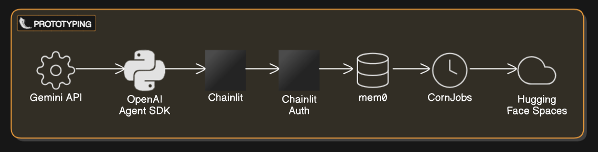

# Tasker: An Ai Agent for Scheduling

## Overview of the Plan:
The goal is to create an AI agent that interacts with users to schedule tasks (e.g., posting on social media, sending emails) at specific times or based on events, using free or low-cost resources for rapid prototyping and scaling to a full product. The plan progresses through three phases:
1) Rapid Prototyping: Build a minimal working version to validate the concept.
2) Development: Expand functionality, improve reliability, and add features.
3) Deployment and Scaling: Deploy the app, optimize for production, and plan for future use cases.

## Initail Architecture For Prototyping

### Stack:
- OpenAI Agent SDK (Framework)
- Chainlit (Ui/Basic Auth)
- CornJobs (Schedulin)
- Gemini (LLM)
- Mem0 (User Long Term Memory)
- Huggingface spaces (Deployment)

[Click Here to See Complete Discussion & Initial plan  👉🏻 ](https://grok.com/share/bGVnYWN5_7cca720c-fcd0-4a1f-9f72-8e0cfd74319a)

## How to Contribute?
[Here is an Contributors Guide 📚👉🏻 ](./contribute.md)

### Any Issues? 👉🏻:
**Emain** : ibad3572@gmail.com